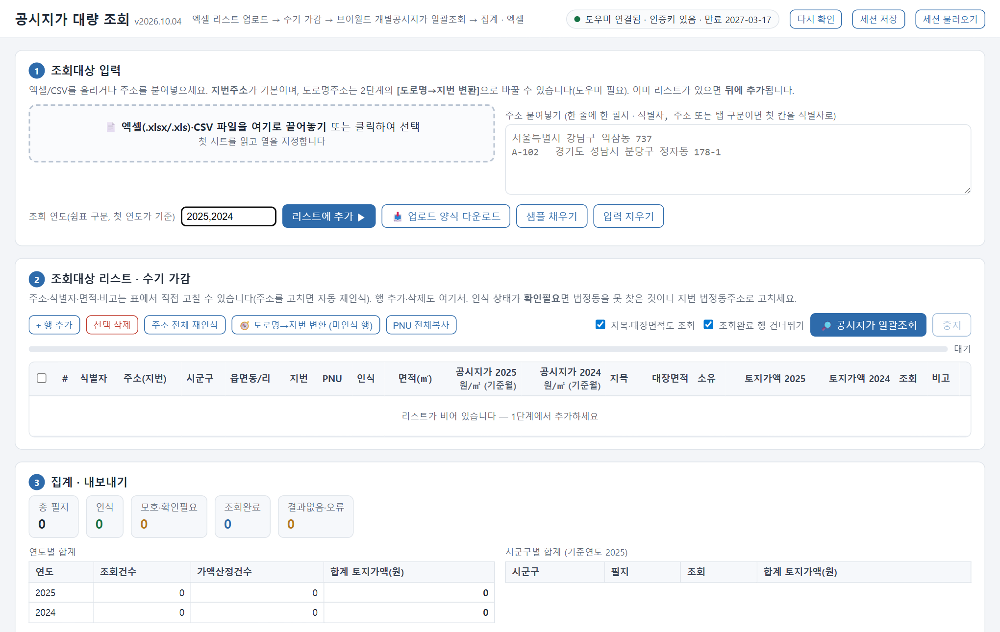
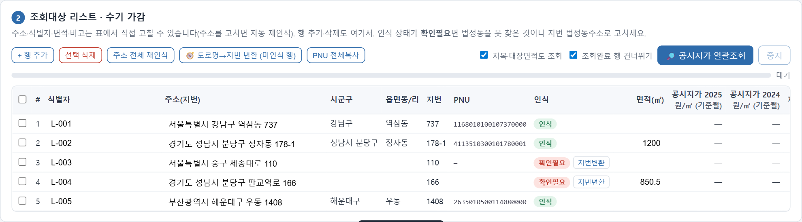
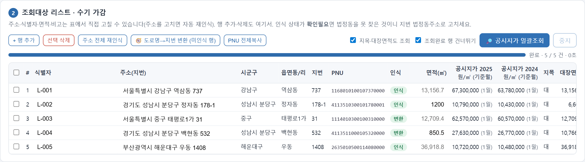

# 공시지가 대량조회

엑셀로 정리한 토지 목록을 올리면 필지별 **개별공시지가**를 국토교통부 브이월드에서 일괄 조회해 집계하고, 엑셀로 내려받는 Windows용 무료 도구입니다. 설치 프로그램이 없습니다.

> 📝 소개·사용 후기·문의: [네이버 블로그](https://blog.naver.com/henmoogi)

## 👉 내려받기

[**Releases**](../../releases/latest)에서 `land-price-bulk_v<버전>.zip`(공시지가대량조회)을 받으세요. 파일 확인값(SHA-256)은 릴리스 설명에 있습니다.

## 할 수 있는 일
- 엑셀(또는 붙여넣기) 토지 목록 → 필지별 개별공시지가 일괄 조회, 여러 연도 동시(예: 2025·2024)
- 도로명주소 → 지번주소 자동 변환(브이월드 지오코더)
- 지목·토지대장 면적 조회, 토지가액(공시지가 × 면적) 계산
- 연도별·시군구별 합계, 엑셀 내보내기(조회결과 · 요약 · 조회로그)
- 표에서 직접 수정·행 추가/삭제, 작업 세션 저장·불러오기

| 목록 확인 | 조회 결과 |
|---|---|
|  |  |

## 시작하기
1. zip을 받아 **압축을 풉니다**.
2. [브이월드](https://www.vworld.kr)에서 본인 인증키를 발급받습니다(무료). 서비스URL은 `http://localhost`, 활용API는 **2D데이터 API**와 **지오코더 API**를 체크합니다.
3. `automation\vworld_key.txt.example`을 복사해 `automation\vworld_key.txt`로 이름을 바꾸고, 첫 줄에 인증키를 적습니다.
4. `01 공시지가_조회_실행.cmd`를 더블클릭합니다.

자세한 내용은 [사용자 매뉴얼](automation/00%20사용자%20매뉴얼(공시지가%20대량조회).md)을 보세요.

## 동작 방식과 안전성
- 브라우저는 브이월드 API를 직접 호출할 수 없어서(교차출처 차단), `automation\공시지가_도우미.ps1`이 **내 PC의 127.0.0.1:43129에서만** 대신 호출합니다. 외부에서 접속할 수 없습니다.
- 윈도우에 내장된 PowerShell로 실행되며 설치·레지스트리 변경이 없습니다.
- 입력한 주소와 결과는 내 PC와 브이월드 사이에서만 오갑니다. 제작자에게 보내는 정보는 없습니다.
- 인증키는 각자 발급해 각자 PC의 `vworld_key.txt`에만 둡니다(이 저장소에는 키가 없습니다).
- 서명되지 않은 스크립트라 실행 시 Windows SmartScreen 경고가 나올 수 있습니다([추가 정보] → [실행]).

## 면책
개인이 만든 **비공식** 도구로 국토교통부·브이월드·한국부동산원과 관계가 없습니다. 조회 값은 브이월드 API 응답을 그대로 옮긴 참고자료이며 정확성·완전성을 보증하지 않습니다. 업무에 쓸 때는 공식 열람화면(부동산공시가격알리미 등)과 대조하세요. 사용 결과에 대한 책임은 사용자에게 있습니다.

## 라이선스
- 이 도구: [MIT License](LICENSE)
- 내장 라이브러리: SheetJS Community Edition 0.18.5 — Apache License 2.0 (© SheetJS LLC)
- 데이터: 국토교통부 브이월드 오픈API(사용자 본인 인증키), 행정안전부 법정동코드
- 자세한 고지: [THIRD_PARTY_NOTICES.txt](THIRD_PARTY_NOTICES.txt)
